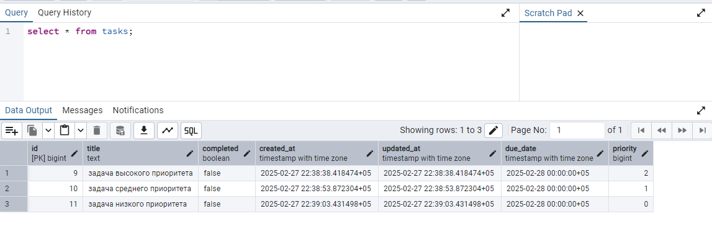

# Task Manager - Руководство по развертыванию и архитектуре

## Оглавление
- [Описание проекта](#описание-проекта)
- [Архитектура](#архитектура)
- [Требования](#требования)
- [Установка и запуск](#установка-и-запуск)
- [Структура проекта](#структура-проекта)
- [Технический стек](#технический-стек)

## Описание проекта
Task Manager - это десктопное приложение для управления задачами, построенное на базе Wails (Go) и Next.js. Приложение поддерживает создание, управление и отслеживание задач с различными приоритетами и сроками выполнения.

## Архитектура

### Backend (Go)
Проект использует трехслойную архитектуру:
1. **Repository Layer** (`internal/repository`)
   - Прямое взаимодействие с базой данных
   - Реализация CRUD операций
   - Использование GORM для ORM

2. **Service Layer** (`internal/service`)
   - Бизнес-логика приложения
   - Валидация данных
   - Обработка бизнес-правил

3. **Application Layer** (`app.go`)
   - Интеграция с Wails
   - Обработка запросов от фронтенда
   - Координация между слоями

### Frontend (Next.js + TypeScript)
- Построен на компонентной архитектуре React
- Использует shadcn/ui для UI компонентов
- Реализует паттерн "Единого источника правды"
- Типизирован с помощью TypeScript

## Требования

### Системные требования
- Go 1.21+
- Node.js 18+
- PostgreSQL 14+
- Wails CLI

### Зависимости базы данных
- PostgreSQL
- Поддержка миграций через sql-migrate

## Установка и запуск

1. **Клонирование репозитория**
```bash
git clone <repository-url>
cd dmark-test
```

2. **Настройка переменных окружения**
```bash
# Создайте файл .env в корневой директории
cp .env.example .env

# Отредактируйте .env файл со следующими параметрами:
DB_HOST=localhost
DB_USER=your_username
DB_PASSWORD=your_password
DB_NAME=task_manager
DB_PORT=5432
```

3. **Установка зависимостей**
```bash
# Backend
go mod download

# Frontend
cd frontend
npm install
```

4. **Миграции базы данных**
```bash
# Из корневой директории проекта
go run migrate.go up
```

5. **Запуск в режиме разработки**
```bash
wails dev
```

### Важные замечания по сборке:
- `.env` файл **обязательно** должен быть создан до запуска приложения
- При запуске `build.bat`, `.env` файл автоматически копируется в директорию `build/bin`
- Если вы запускаете exe файл напрямую, убедитесь что `.env` находится в той же директории

6. **Сборка приложения**
```bash
wails build
```

## Структура проекта

```
dmark-test/
├── frontend/                 # Frontend приложение (Next.js)
│   ├── src/
│   │   ├── app/            # Компоненты и страницы
│   │   ├── components/     # UI компоненты
│   │   └── types/         # TypeScript типы
├── internal/                # Backend код
│   ├── config/            # Конфигурация
│   ├── models/            # Модели данных
│   ├── repository/        # Слой доступа к данным
│   └── service/          # Бизнес-логика
├── migrations/             # SQL миграции
├── app.go                 # Основной класс приложения
└── main.go                # Точка входа
```

## Технический стек

### Backend
- Go 1.21
- Wails v2
- GORM (ORM)
- PostgreSQL
- sql-migrate

### Frontend
- Next.js 14
- TypeScript
- shadcn/ui
- Tailwind CSS
- date-fns
- lucide-react

### Инструменты разработки
- Wails CLI
- Node.js и npm
- PostgreSQL
- Git

## Дополнительная информация

### Работа с базой данных
База данных использует миграции для управления схемой. Миграции находятся в директории `migrations/` и применяются автоматически при запуске приложения.

### Безопасность
- Все запросы к базе данных параметризованы
- Используется GORM для предотвращения SQL-инъекций
- Валидация входных данных на уровне сервиса

### Масштабируемость
- Модульная архитектура позволяет легко добавлять новые функции
- Четкое разделение ответственности между слоями
- Типизированный код как на frontend, так и на backend

### Поддержка
При возникновении проблем:
1. Проверьте логи приложения
2. Убедитесь в корректности настроек базы данных
3. Проверьте версии зависимостей

## Функциональность
### Основные возможности:
- ✅ **Добавление задач** — ввод текста, выбор приоритета и даты выполнения.
- ✅ **Отображение списка задач** — активные и выполненные задачи.
- ✅ **Удаление задач** — возможность удаления задач с подтверждением.
- ✅ **Изменение статуса** — отметка задачи как выполненной и возможность отменить выполнение.
- ✅ **Сохранение состояния** — все задачи сохраняются в базе данных (PostgreSQL) и загружаются при старте.

### Дополнительные возможности:
- ✅ **Приоритет задач** — низкий, средний и высокий.
- ✅ **Дата выполнения** — выбор даты через календарь.
- ✅ **Группировка задач** — разделение на активные и выполненные.
- ✅ **База данных** — сохранение данных через GORM (PostgreSQL).

## Скриншоты
### Главный экран


### Добавление задачи


### Валидация ввода (проверка на пустой ввод)
- Валидация реализована в файле frontend/src/app/page.tsx, функция handleAddTask()
```
const handleAddTask = async () => {
    if (!newTask.trim()) return;
   ...
}
```

### Задачи разных приоритетов




### Добавление даты


### Отмена отметки выполненной задачи


### Удаление задачи


### Выполненные задачи


### Загрузка состояния задач при запуске приложения


### Интерфейс для взаимодействия с репозиторием

#### Репозиторий (TaskRepository)
**Файл**: `internal/repository/task_repository.go`

Методы для работы с задачами:
- `Create(task *models.Task) error` — создание задачи
- `GetAll() ([]models.Task, error)` — получение всех задач
- `Update(task *models.Task) error` — обновление задачи
- `Delete(id uint) error` — удаление задачи
- `ToggleComplete(id uint) error` — смена статуса задачи

#### Сервис (TaskService)
**Файл**: `internal/service/task_service.go`

Содержит бизнес-логику, использует TaskRepository

Методы:
- `CreateTask(input CreateTaskInput) error`
- `GetTasksByStatus() (TaskList, error)`
- `ToggleTask(id uint) error`
- `DeleteTask(id uint) error`
- `GetTasksByPriority() (map[int][]models.Task, error)`
- `GetOverdueTasks() ([]models.Task, error)`